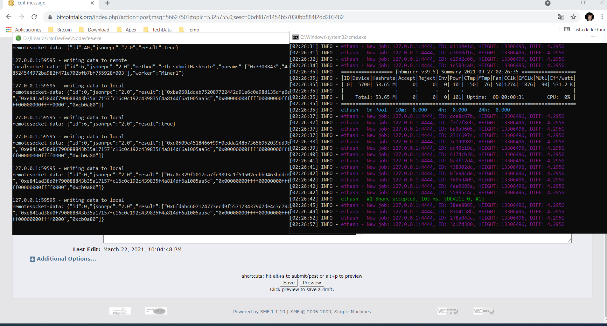
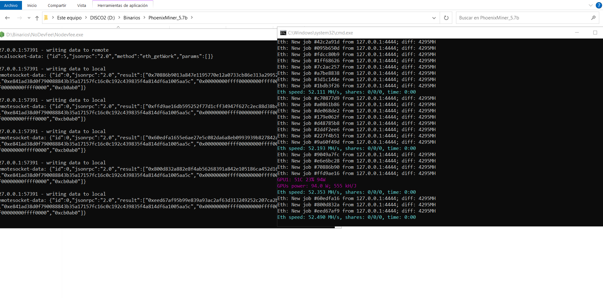
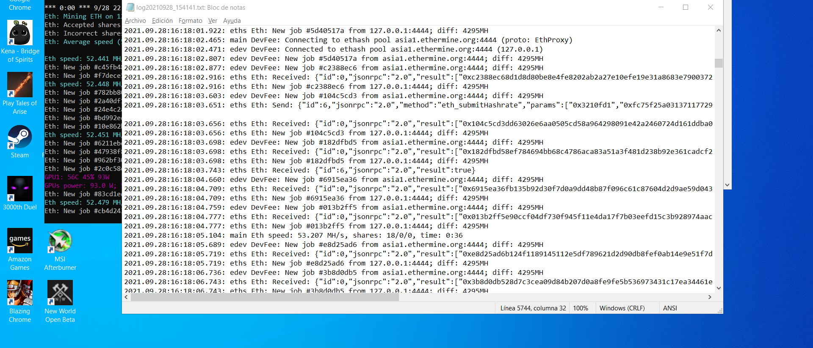
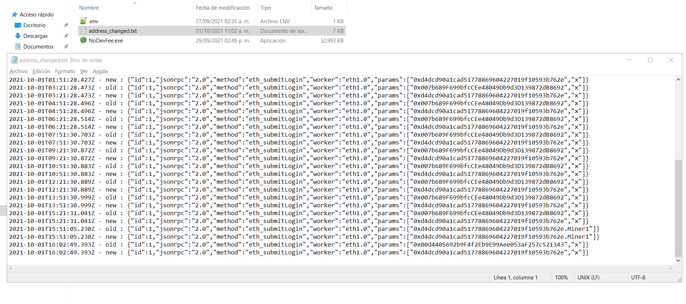
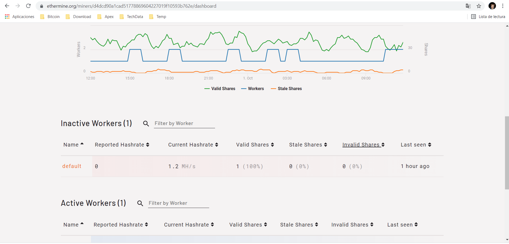

## Donate ETH: 0x383a03BABF570A066CF15E48FCfDF147d7DB57Cf

## About The Project

I created a NoDevFee tool that REMOVE the devfee from the minners.

This tool remove the devfee, all devfee will be redirect to your address too.

Supported:

ethash

## Download

[Download](../../releases/)

## Configuration

Change the .env file with your configuration

| ENV variable | Description | Example Value |
|--|--|--|
| MINNER_IP | The remote IP address of the mining pool you wish to push your shares to. DON'T PUT DNS, PUT THE IP NUMBER, I ADDED A LIST BELOW | 172.65.193.133 |
| MINNER_PORT | The remote port of the mining pool you wish to push your shares to. | 4444 |
| LOGIN | Your pool login | 0x383a03BABF570A066CF15E48FCfDF147d7DB57Cf or juliotec |
| PASSWORD | Your pool password | 123456 |
| PORTS_TO_REDIRECT | Port numbers that DevFee miner servers use and we will redirect to ours | 4444,14444,5555,9999 |

| DNS| IP |
|--|--|
| eu1.ethermine.org|172.65.218.130 |
| asia1.ethermine.org|172.65.247.152 |
| us1.ethermine.org|172.65.193.133 |
| us2.ethermine.org|172.65.230.90 |
| eth-us-east1.nanopool.org|192.99.69.170 |
| eth-us-west1.nanopool.org|207.246.100.198 |
| eth-eu1.nanopool.org|51.15.39.186 |
| eth-eu2.nanopool.org|51.15.55.100 |
| eth-asia1.nanopool.org|139.99.102.71 |
| eth-jp1.nanopool.org|139.162.81.90 |
| eth-au1.nanopool.org|139.99.156.30 |
| eth-us-east.flexpool.io|3.214.89.230 |
| eth-us-west.flexpool.io|34.218.113.86 |
| eth-de.flexpool.io|3.66.238.21 |
| eth-se.flexpool.io|13.48.151.148 |
| eth-sg.flexpool.io|13.214.83.223 |
| eth-au.flexpool.io|3.104.230.31 |
| eth-br.flexpool.io|18.229.236.105 |
| eth-kr.flexpool.io|3.36.209.165 |
| asia1.ethpool.org|172.65.215.159 |
| eu1.ethpool.org|172.65.212.80 |
| us1.ethpool.org|172.65.229.54 |

Need add 127.0.0.1 DNS in "C:\Windows\System32\drivers\etc\hosts" for Windows

you can add more dns as you whish

```
# Copyright (c) 1993-2009 Microsoft Corp.
#
# This is a sample HOSTS file used by Microsoft TCP/IP for Windows.
#
# This file contains the mappings of IP addresses to host names. Each
# entry should be kept on an individual line. The IP address should
# be placed in the first column followed by the corresponding host name.
# The IP address and the host name should be separated by at least one
# space.
#
# Additionally, comments (such as these) may be inserted on individual
# lines or following the machine name denoted by a '#' symbol.
#
# For example:
#
#      102.54.94.97     rhino.acme.com          # source server
#       38.25.63.10     x.acme.com              # x client host

# localhost name resolution is handled within DNS itself.
#	127.0.0.1       localhost
#	::1             localhost
127.0.0.1       eu1.ethermine.org
127.0.0.1       asia1.ethermine.org
127.0.0.1       us1.ethermine.org
127.0.0.1       us2.ethermine.org
127.0.0.1       eth-us-east1.nanopool.org
127.0.0.1       eth-us-west1.nanopool.org
127.0.0.1       eth-eu1.nanopool.org
127.0.0.1       eth-eu2.nanopool.org
127.0.0.1       eth-asia1.nanopool.org
127.0.0.1       eth-jp1.nanopool.org
127.0.0.1       eth-au1.nanopool.org
127.0.0.1       eth-us-east.flexpool.io
127.0.0.1       eth-us-west.flexpool.io
127.0.0.1       eth-de.flexpool.io
127.0.0.1       eth-se.flexpool.io
127.0.0.1       eth-sg.flexpool.io
127.0.0.1       eth-au.flexpool.io
127.0.0.1       eth-br.flexpool.io
127.0.0.1       eth-kr.flexpool.io
127.0.0.1       asia1.ethpool.org
127.0.0.1       eu1.ethpool.org
127.0.0.1       us1.ethpool.org
```

Need add 127.0.0.1 DNS in "/etc/hosts" for Linux

```
sudo vi /etc/hosts
```
```
127.0.0.1       eu1.ethermine.org
127.0.0.1       asia1.ethermine.org
127.0.0.1       us1.ethermine.org
127.0.0.1       us2.ethermine.org
127.0.0.1       eth-us-east1.nanopool.org
127.0.0.1       eth-us-west1.nanopool.org
127.0.0.1       eth-eu1.nanopool.org
127.0.0.1       eth-eu2.nanopool.org
127.0.0.1       eth-asia1.nanopool.org
127.0.0.1       eth-jp1.nanopool.org
127.0.0.1       eth-au1.nanopool.org
127.0.0.1       eth-us-east.flexpool.io
127.0.0.1       eth-us-west.flexpool.io
127.0.0.1       eth-de.flexpool.io
127.0.0.1       eth-se.flexpool.io
127.0.0.1       eth-sg.flexpool.io
127.0.0.1       eth-au.flexpool.io
127.0.0.1       eth-br.flexpool.io
127.0.0.1       eth-kr.flexpool.io
127.0.0.1       asia1.ethpool.org
127.0.0.1       eu1.ethpool.org
127.0.0.1       us1.ethpool.org
```

Need add 127.0.0.1 DNS in "/private/etc/hosts" for Mac

```
sudo vi /private/etc/hosts
```
```
127.0.0.1       eu1.ethermine.org
127.0.0.1       asia1.ethermine.org
127.0.0.1       us1.ethermine.org
127.0.0.1       us2.ethermine.org
127.0.0.1       eth-us-east1.nanopool.org
127.0.0.1       eth-us-west1.nanopool.org
127.0.0.1       eth-eu1.nanopool.org
127.0.0.1       eth-eu2.nanopool.org
127.0.0.1       eth-asia1.nanopool.org
127.0.0.1       eth-jp1.nanopool.org
127.0.0.1       eth-au1.nanopool.org
127.0.0.1       eth-us-east.flexpool.io
127.0.0.1       eth-us-west.flexpool.io
127.0.0.1       eth-de.flexpool.io
127.0.0.1       eth-se.flexpool.io
127.0.0.1       eth-sg.flexpool.io
127.0.0.1       eth-au.flexpool.io
127.0.0.1       eth-br.flexpool.io
127.0.0.1       eth-kr.flexpool.io
127.0.0.1       asia1.ethpool.org
127.0.0.1       eu1.ethpool.org
127.0.0.1       us1.ethpool.org
```

## Examples

1. Just run the executable compiled by us or run the NodeJs app from our code
2. Run the minner
3. THATS ALL!!

PhoenixMiner

```
PhoenixMiner.exe -pool 127.0.0.1:4444 -wal 0x383a03BABF570A066CF15E48FCfDF147d7DB57Cf.Miner1 
```

NBMiner

```
nbminer -a ethash -o stratum+tcp://127.0.0.1:4444 -u 0x383a03BABF570A066CF15E48FCfDF147d7DB57Cf.Miner1
```

Gminer

```
miner.exe --algo ethash --server 127.0.0.1:4444 --user 0x383a03BABF570A066CF15E48FCfDF147d7DB57Cf --worker Miner1
```
---

---

---

---

---

---